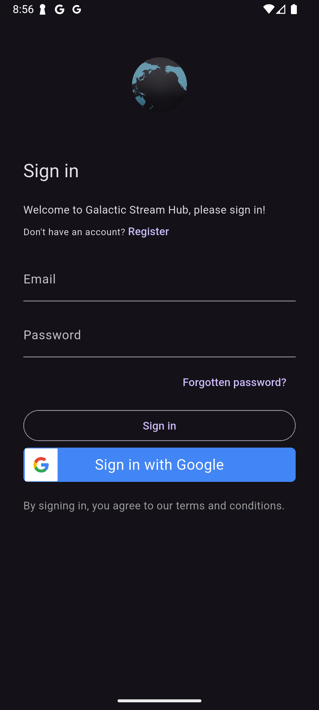
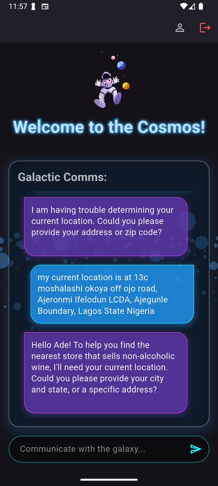
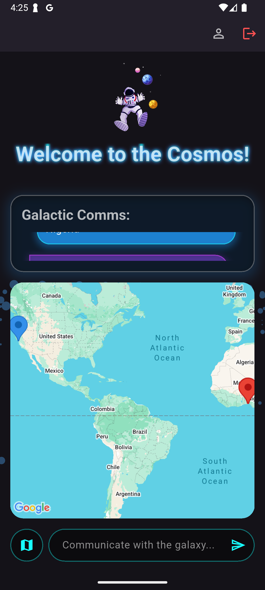

# Galactic Stream Hub 🚀

Galactic Stream Hub is a Flutter mobile application that demonstrates a unique blend of real-time communication and interactive mapping. Users can sign in using Firebase Authentication, engage in a chat interface powered by WebSockets, and receive intelligent responses that can include geographical locations.

The app dynamically parses these locations from messages, geocodes them, and visualizes them on an integrated Google Map, creating a rich, context-aware user experience. The app is styled with a celestial, space-themed UI, enhanced with Lottie and `flutter_animate` animations.

## 🌌 Features

*   **Secure Authentication:** Robust and easy-to-use sign-in/sign-up flow using Firebase UI for both Email/Password and Google Sign-In.
*   **Real-time Chat:** Bidirectional communication with a WebSocket server for instant message delivery.
*   **Intelligent Response Parsing:** The app can parse both structured JSON and unstructured text from server messages to identify and extract location data (name, address, rating).
*   **Interactive Map View:** A toggleable Google Map that displays geocoded locations from chat responses as markers.
*   **User-Centric Mapping:** Automatically includes a marker for the user's current location and animates the camera to fit all relevant points of interest.
*   **Location-Aware Context:** Sends the user's current latitude and longitude with outgoing messages, allowing for more personalized and geographically relevant server responses.
*   **Engaging Animations:** Utilizes Lottie for beautiful, lightweight animations on the auth and home screens, and `flutter_animate` for smooth UI transitions.
*   **Resilient Connectivity:** Implements an exponential backoff strategy to automatically handle WebSocket disconnections and attempt reconnection.

## 📸 Screenshots

| Auth Screen | Chat Interface | Map View |
| :---: |:---:|:---:|
|  |  |  |

## 🛠️ Tech Stack & Key Packages

*   **Framework:** Flutter
*   **Authentication:** `firebase_auth`, `firebase_ui_auth`, `firebase_ui_oauth_google`
*   **Mapping & Location:** `google_maps_flutter`, `geolocator`, `geocoding`
*   **Networking:** `web_socket_channel`
*   **Animations:** `lottie`, `flutter_animate`
*   **State Management:** `StatefulWidget` (`setState`)

## ⚙️ Getting Started

Follow these instructions to get the project up and running on your local machine.

### 1. Firebase Setup

This project is configured to use Firebase.

1.  Create a new Firebase project at console.firebase.google.com.
2.  Follow the instructions to add an Android and/or iOS app to your project.
3.  Use the FlutterFire CLI to configure your app. This will generate a `firebase_options.dart` file for you.
    ```sh
    flutterfire configure
    ```
4.  In your Firebase project console, navigate to **Authentication** > **Sign-in method** and enable **Email/Password** and **Google Sign-In**.

### 2. Google Maps API Key

You will need a Google Maps API key for the map functionality.

1.  Go to the Google Cloud Console.
2.  Enable the **Maps SDK for Android** and/or **Maps SDK for iOS**.
3.  Get an API key.
4.  **For Android:** Add your API key to `android/app/src/main/AndroidManifest.xml`:
    ```xml
    <application ...>
        ...
        <meta-data android:name="com.google.android.geo.API_KEY"
                   android:value="YOUR_KEY_HERE"/>
        ...
    </application>
    ```
5.  **For iOS:** Add your API key to `ios/Runner/AppDelegate.swift`:
    ```swift
    import UIKit
    import Flutter
    import GoogleMaps

    @UIApplicationMain
    @objc class AppDelegate: FlutterAppDelegate {
      override func application(
        _ application: UIApplication,
        didFinishLaunchingWithOptions launchOptions: [UIApplication.LaunchOptionsKey: Any]?
      ) -> Bool {
        GMSServices.provideAPIKey("YOUR_KEY_HERE") // Add this line
        GeneratedPluginRegistrant.register(with: self)
        return super.application(application, didFinishLaunchingWithOptions: launchOptions)
      }
    }
    ```

### 3. Location Permissions

*   **For Android:** Permissions are already included in `android/app/src/main/AndroidManifest.xml`.
*   **For iOS:** Add the following keys to your `ios/Runner/Info.plist` file with descriptions of why you need location access:
    ```xml
    <key>NSLocationWhenInUseUsageDescription</key>
    <string>This app needs access to location to show your position on the map and provide relevant results.</string>
    <key>NSLocationAlwaysUsageDescription</key>
    <string>This app needs access to location to show your position on the map and provide relevant results.</string>
    ```

### 4. Installation & Running

```sh
# Clone the repository
git clone <repository-url>

# Get dependencies
flutter pub get

# Run the app
flutter run
```

### 🔌 Backend Note

The chat functionality in this app is designed to connect to a WebSocket server at `wss://app.galactic-streamhub.com/ws`. This server is responsible for processing user messages (including location context) and sending back responses, which may contain the location data that the app visualizes. To experience the full functionality, a compatible backend service is required.